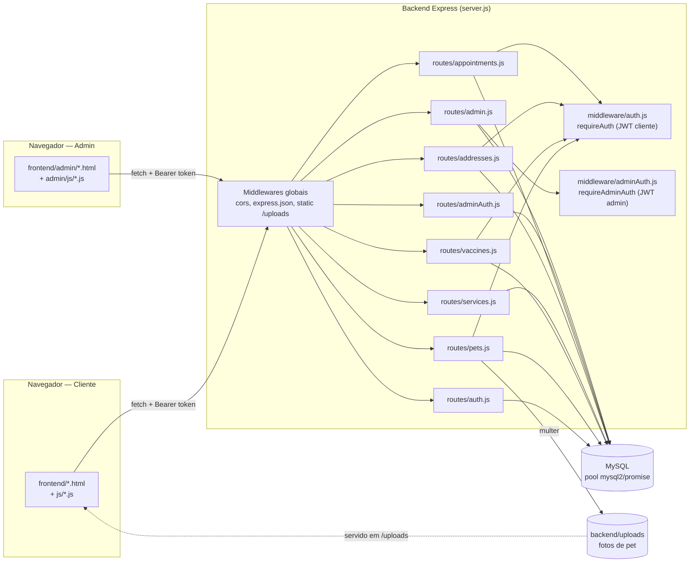
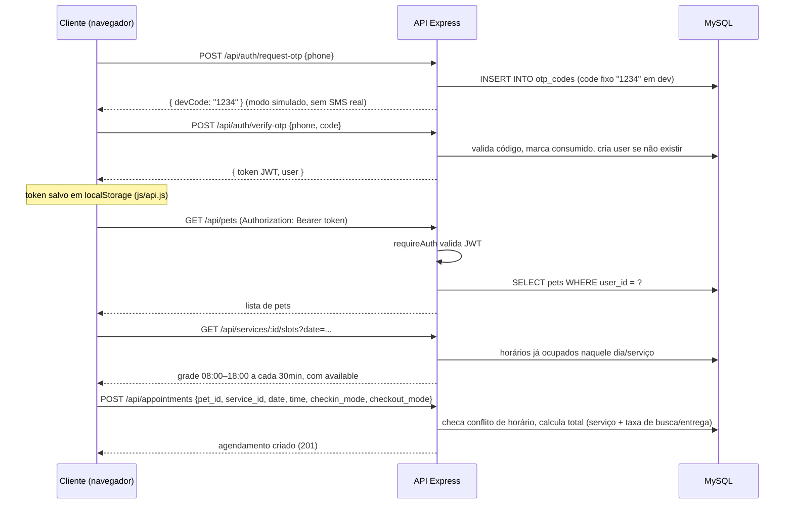
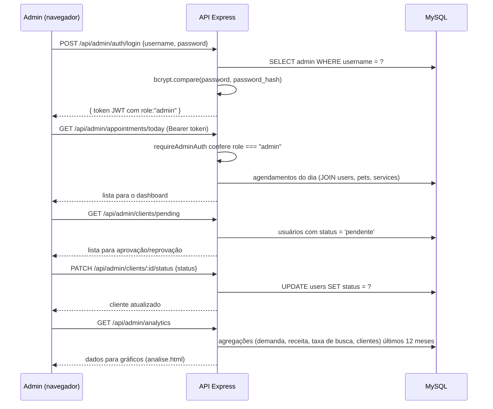
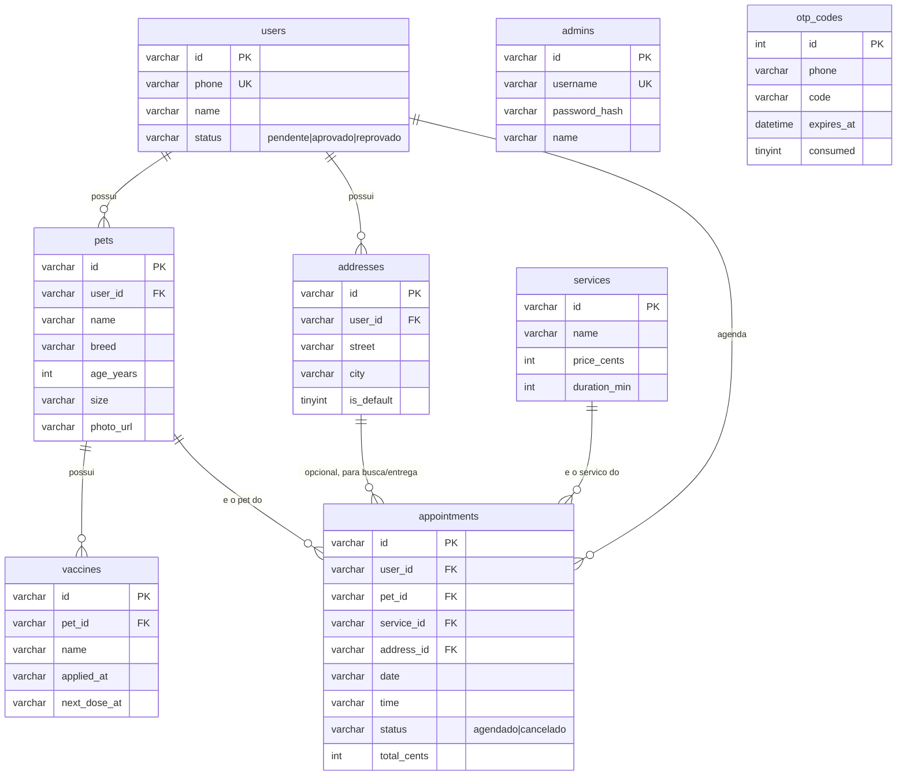

# Cafofo do Pet 🐾

App de agendamento de serviços para pets (banho, tosa e veterinário), com painel
administrativo para o pet shop. Web, responsivo, dois times de páginas (cliente e admin)
consumindo a mesma API REST.

- **Frontend:** HTML + CSS + JavaScript puro (sem build step/bundler), múltiplas páginas
  estáticas consumindo a API via `fetch`
- **Backend:** Node.js + Express (API REST, arquitetura em camadas rotas → middlewares → banco)
- **Banco de dados:** MySQL (via `mysql2/promise`, pool de conexões) — hospedado no
  desenvolvimento em uma instância gerenciada (Aiven)
- **Autenticação:** JWT (JSON Web Token), dois papéis distintos: cliente (OTP por telefone)
  e administrador (usuário/senha com hash bcrypt)

> **Requisito:** Node.js **18+** no backend. O projeto já não depende de `node:sqlite`
> (versão anterior) — hoje usa MySQL via `mysql2`.

## Estrutura do projeto

```
TCC-frontend-html-css-js/
├── backend/
│   ├── server.js              # bootstrap do Express: middlewares globais + registro de rotas
│   ├── db/
│   │   ├── database.js        # pool mysql2 + criação de schema (CREATE TABLE IF NOT EXISTS)
│   │   └── seed.js            # dados iniciais: serviços padrão + admin default
│   ├── middleware/
│   │   ├── auth.js            # JWT do cliente (signToken / requireAuth)
│   │   ├── adminAuth.js       # JWT do admin (signAdminToken / requireAdminAuth)
│   │   └── asyncHandler.js    # wrapper p/ propagar erros async ao error handler do Express
│   ├── routes/
│   │   ├── auth.js            # OTP (request/verify), perfil do cliente
│   │   ├── pets.js             # CRUD de pets (+ upload de foto via multer)
│   │   ├── vaccines.js         # CRUD de vacinas (aninhado em pets/:petId)
│   │   ├── services.js         # catálogo de serviços + horários disponíveis (slots)
│   │   ├── addresses.js        # CRUD de endereços do cliente
│   │   ├── appointments.js     # criação/listagem/cancelamento de agendamentos
│   │   ├── adminAuth.js        # login do admin
│   │   └── admin.js            # dashboard, calendário, clientes, analytics
│   └── uploads/                # arquivos enviados (fotos de pet), servidos em /uploads
└── frontend/
    ├── index.html … sucesso.html   # jornada do cliente (uma página por etapa)
    ├── js/                          # api.js, config.js, guard.js + 1 script por página
    ├── css/style.css
    └── admin/                       # páginas e scripts do painel administrativo
```

## Como rodar localmente

Você vai precisar de **Node.js 18+** e de um banco **MySQL** acessível (local ou um serviço
gerenciado, ex. Aiven/PlanetScale/RDS). Abra dois terminais.

### 1. Backend

```bash
cd backend
npm install
```

Crie um arquivo `.env` (não versionado) com:

```
DB_HOST=...
DB_PORT=3306
DB_USER=...
DB_PASSWORD=...
DB_NAME=cafofo_do_pet
PORT=3333
# opcionais:
# JWT_SECRET=troque-este-segredo-em-producao
# ADMIN_DEFAULT_PASSWORD=admin123
```

```bash
npm run dev
```

A API sobe em `http://localhost:3333`. Na primeira execução, `initDatabase()` cria as tabelas
(`CREATE TABLE IF NOT EXISTS`) e `seed()` insere os serviços padrão (Banho, Tosa) e um
administrador padrão (usuário `admin`, senha `admin123` ou o valor de `ADMIN_DEFAULT_PASSWORD`).

### 2. Frontend

O frontend é HTML/CSS/JS puro, sem build step. Basta servir a pasta `frontend/` como arquivos
estáticos — por exemplo, com a extensão Live Server do VS Code, `npx serve frontend` ou o
Apache do XAMPP apontando para essa pasta.

Por padrão as páginas chamam a API em `http://<mesmo-host-da-página>:3333/api`
(ver `frontend/js/config.js` — isso funciona tanto em `localhost` quanto acessando pelo IP da
máquina na rede, ex. pelo celular). Se precisar apontar para outra URL, defina
`window.CAFOFO_API_URL = "https://sua-api/api"` num `<script>` antes de importar `js/config.js`.

Abra `frontend/index.html` (jornada do cliente) ou `frontend/admin/login.html` (painel
administrativo) pelo servidor estático escolhido.

## Arquitetura



## Fluxo do cliente (OTP + agendamento)



## Fluxo do administrador



## Modelo de dados



## Conceitos e padrões usados

- **REST sobre Express**: cada recurso (`pets`, `services`, `appointments`, ...) tem seu próprio
  `Router` em `backend/routes/`, montado em `server.js` com um prefixo (`app.use("/api/pets", ...)`).
- **Middleware chain**: `router.use(requireAuth)` no topo de um arquivo de rotas protege
  *todas* as rotas daquele router de uma vez, em vez de repetir o middleware rota a rota.
- **JWT (JSON Web Token) com dois papéis**: o mesmo mecanismo (`jsonwebtoken`) assina tokens
  diferentes para cliente (`signToken`) e admin (`signAdminToken`, com `role: "admin"` no
  payload). `requireAuth` rejeita tokens de admin e vice-versa, isolando os dois domínios de
  acesso mesmo compartilhando o segredo (`JWT_SECRET`).
- **OTP (One-Time Password) simulado**: em vez de mandar SMS de verdade, `routes/auth.js` grava
  um código fixo (`1234`) em `otp_codes` com expiração (`OTP_TTL_MINUTES`) e devolve o código
  na própria resposta (`devCode`) — troque isso por um provedor real (Twilio, Zenvia) em produção.
- **Hash de senha com bcrypt**: a senha do admin nunca é guardada em texto puro —
  `bcrypt.hash` no seed, `bcrypt.compare` no login.
- **Async error handling**: `asyncHandler` envolve cada handler assíncrono e encaminha
  exceções para o middleware de erro do Express (`app.use((err, req, res, next) => ...)`),
  evitando `try/catch` repetido em toda rota.
- **Pool de conexões (mysql2/promise)**: `db.all/get/run` em `db/database.js` é uma camada de
  compatibilidade fina sobre o pool, mantendo a mesma API que o projeto usava antes com
  SQLite (facilita ler o código, já que toda query segue `db.get(sql, params)`).
- **Migração leve por `IF NOT EXISTS`/try-catch**: `initDatabase()` roda `CREATE TABLE IF NOT
  EXISTS` sempre e tenta um `ALTER TABLE` idempotente (ignorando erro de coluna duplicada) —
  substitui um sistema de migrations formal, adequado ao porte do projeto.
- **Upload de arquivos com multer**: fotos de pet chegam como `multipart/form-data`, são
  salvas em `backend/uploads` com nome aleatório (`uuid`) e servidas estaticamente via
  `express.static`; o front resolve a URL relativa (`/uploads/x.jpg`) para absoluta com
  `resolveAssetUrl`, pois a API pode estar em origem diferente do frontend estático.
- **Route guard no frontend sem framework**: `frontend/js/guard.js` reproduz o papel de um
  `ProtectedRoute`/`AuthProvider` de SPA — cada página protegida chama `requireAuth()` no
  topo do script, que valida o token contra `GET /api/auth/me` antes de renderizar.
- **Token em `localStorage`, estado de navegação em `sessionStorage`**: o JWT persiste entre
  sessões do navegador; dados temporários do fluxo de agendamento (serviço escolhido, contexto
  de OTP) ficam em `sessionStorage` e são limpos no `logout()`.
- **Detecção de conflito de horário**: `POST /api/appointments` confere se já existe um
  agendamento não cancelado para o mesmo serviço/data/hora antes de criar (evita overbooking
  em corrida de requisições simultâneas, checando no próprio `INSERT`).
- **Regra de negócio simples para slots**: `GET /api/services/:id/slots` gera uma grade fixa
  (08:00–18:00, a cada 30min) e marca como indisponível o que já está ocupado, em vez de um
  sistema de agenda configurável — dimensionado para o escopo do TCC.
- **Sem build step no frontend**: HTML/CSS/JS puro, uma página por tela, importado via
  `<script type="module">`; `frontend/js/config.js` resolve a URL da API dinamicamente a
  partir do host que serviu a página, o que permite testar tanto em `localhost` quanto pelo
  IP da máquina na rede (ex. celular na mesma Wi-Fi), sem variável de ambiente de build.

## Variáveis de ambiente (backend/.env)

| Variável | Obrigatória | Descrição |
|---|---|---|
| `DB_HOST` | sim | Host do MySQL |
| `DB_PORT` | não (padrão 3306) | Porta do MySQL |
| `DB_USER` | sim | Usuário do MySQL |
| `DB_PASSWORD` | sim | Senha do MySQL |
| `DB_NAME` | sim | Nome do banco |
| `PORT` | não (padrão 3333) | Porta em que a API sobe |
| `JWT_SECRET` | recomendada em produção | Segredo de assinatura dos tokens JWT (cliente e admin) |
| `ADMIN_DEFAULT_PASSWORD` | não (padrão `admin123`) | Senha do admin criado pelo seed, se ainda não existir nenhum admin |

## Sobre o código de verificação (OTP)

Por padrão o projeto está em **modo simulado**: nenhum SMS é enviado de verdade, o código é
sempre `1234` e a API devolve esse código na resposta (`devCode`) só para facilitar o
desenvolvimento — é por isso que ele aparece na tela de verificação.

Quando quiser conectar um provedor real (ex: Twilio, Zenvia), edite
`backend/routes/auth.js`: troque a geração do código fixo por um código aleatório, remova o
`devCode` da resposta e adicione a chamada ao provedor de SMS na rota `POST /api/auth/request-otp`.

## Principais endpoints da API

| Método | Rota | Autenticação | Descrição |
|---|---|---|---|
| POST | `/api/auth/request-otp` | — | Gera OTP para um telefone |
| POST | `/api/auth/verify-otp` | — | Valida OTP, cria/loga usuário, devolve JWT |
| GET/PATCH | `/api/auth/me` | cliente | Perfil do usuário logado |
| GET/POST | `/api/pets` | cliente | Lista/cria pets (com foto) |
| PUT/DELETE | `/api/pets/:id` | cliente | Edita/remove pet |
| GET/POST | `/api/pets/:petId/vaccines` | cliente | Vacinas de um pet |
| PATCH/DELETE | `/api/vaccines/:id` | cliente | Edita/remove vacina |
| GET | `/api/services` | — | Catálogo de serviços |
| GET | `/api/services/:id/slots?date=` | — | Horários disponíveis no dia |
| GET/POST/DELETE | `/api/addresses` | cliente | Endereços do cliente |
| GET/POST | `/api/appointments` | cliente | Lista/cria agendamentos |
| PATCH | `/api/appointments/:id/cancel` | cliente | Cancela agendamento |
| POST | `/api/admin/auth/login` | — | Login do admin, devolve JWT com `role: admin` |
| GET | `/api/admin/auth/me` | admin | Perfil do admin logado |
| GET | `/api/admin/appointments`, `/today`, `/calendar` | admin | Agenda do pet shop |
| GET | `/api/admin/clients`, `/clients/pending` | admin | Lista de clientes / pendentes de aprovação |
| PATCH | `/api/admin/clients/:id/status` | admin | Aprova/reprova cliente |
| GET | `/api/admin/analytics` | admin | Métricas dos últimos 12 meses (demanda, receita, etc.) |

## Próximos passos sugeridos

- Adicionar um provedor de SMS real para o OTP.
- Hospedar o backend (Render, Railway, Fly.io) e o frontend estático (Vercel, Netlify, GitHub
  Pages) com HTTPS.
- Migrar uploads de `backend/uploads` (disco local) para um storage externo (S3, Cloudinary)
  antes de rodar em ambiente com múltiplas instâncias/deploys efêmeros.
- Testes automatizados (hoje o projeto não tem suíte de testes).
- Migrations formais (ex. `node-pg-migrate`/`umzug`) caso o schema cresça além do que o
  `CREATE TABLE IF NOT EXISTS` + `ALTER TABLE` idempotente do `initDatabase()` suporta bem.
